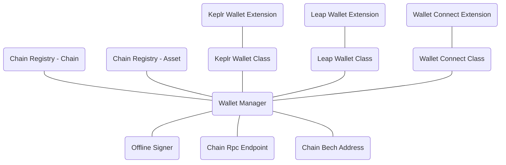
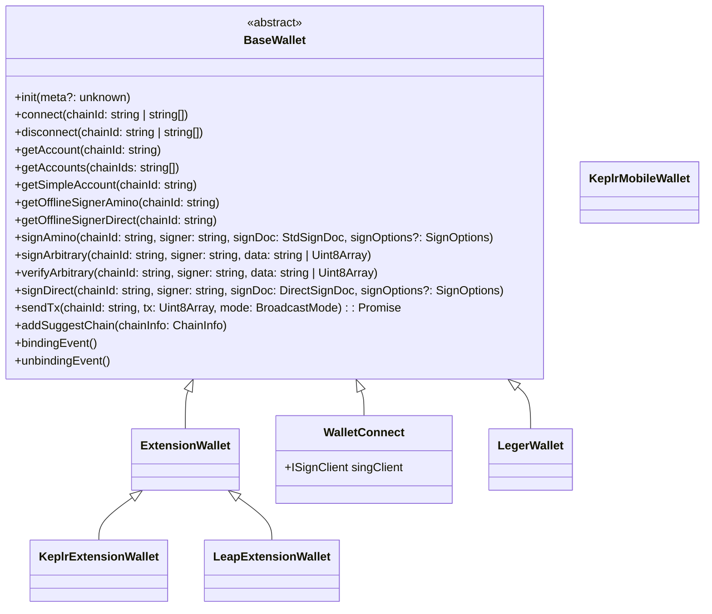

# interchain-kit

<p align="center">
  <br />
    Universal wallet connector for the interchain
</p>

Interchain Kit is a universal wallet adapter for developers to build apps that quickly and easily interact with Cosmos blockchains and wallets.

## Packages

### [@interchain-kit/core](https://github.com/cosmology-tech/interchain-kit/blob/main/packages/core/README.md)
### [@interchain-kit/react](https://github.com/cosmology-tech/interchain-kit/blob/main/packages/react/README.md)

## Wallets
Explore the range of wallet adapters available in our [wallets directory](https://github.com/cosmology-tech/interchain-kit/tree/main/wallets)


## Overview




## UML


## Developing

When first cloning the repo:
```
yarn
yarn build
yarn dev
```

## Related

Checkout these related projects:

* [@cosmology/telescope](https://github.com/cosmology-tech/telescope) Your Frontend Companion for Building with TypeScript with Cosmos SDK Modules.
* [@cosmwasm/ts-codegen](https://github.com/CosmWasm/ts-codegen) Convert your CosmWasm smart contracts into dev-friendly TypeScript classes.
* [chain-registry](https://github.com/cosmology-tech/chain-registry) Everything from token symbols, logos, and IBC denominations for all assets you want to support in your application.
* [cosmos-kit](https://github.com/cosmology-tech/cosmos-kit) Experience the convenience of connecting with a variety of web3 wallets through a single, streamlined interface.
* [create-cosmos-app](https://github.com/cosmology-tech/create-cosmos-app) Set up a modern Cosmos app by running one command.
* [interchain-ui](https://github.com/cosmology-tech/interchain-ui) The Interchain Design System, empowering developers with a flexible, easy-to-use UI kit.
* [starship](https://github.com/cosmology-tech/starship) Unified Testing and Development for the Interchain.

## Credits

🛠 Built by Cosmology — if you like our tools, please consider delegating to [our validator ⚛️](https://cosmology.zone/validator)


## Disclaimer

AS DESCRIBED IN THE LICENSES, THE SOFTWARE IS PROVIDED “AS IS”, AT YOUR OWN RISK, AND WITHOUT WARRANTIES OF ANY KIND.

No developer or entity involved in creating this software will be liable for any claims or damages whatsoever associated with your use, inability to use, or your interaction with other users of the code, including any direct, indirect, incidental, special, exemplary, punitive or consequential damages, or loss of profits, cryptocurrencies, tokens, or anything else of value.

