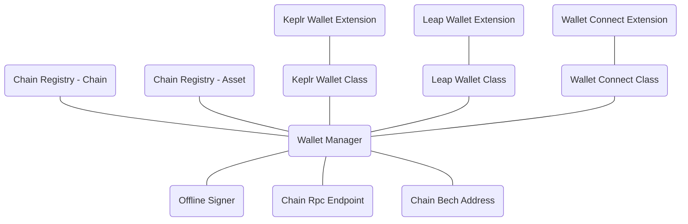
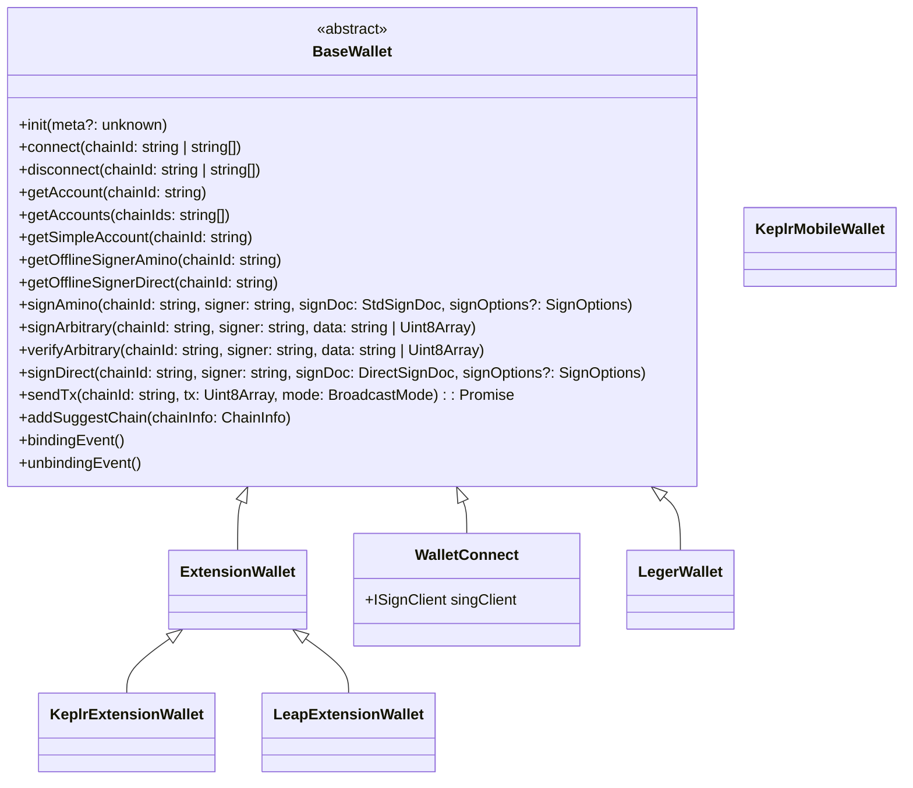

# Interchain Kit

<p align="center" width="100%">
    
</p>

<p align="center" width="100%">
  <a href="https://github.com/hyperweb-io/interchain-kit/actions/workflows/unit-test.yaml">
    
  </a>
    <a href="https://github.com/hyperweb-io/interchain-kit/actions/workflows/e2e-test.yaml">
    
  </a>
  <a href="https://github.com/hyperweb-io/lib-count">
      
  </a>
  <a href="https://github.com/hyperweb-io/lib-count">
      
  </a>
  <br />
   <a href="https://github.com/hyperweb-io/cosmos-kit/blob/main/LICENSE"></a>
   <a href="https://www.npmjs.com/package/cosmos-kit"></a>
</p>

Interchain Kit is a universal wallet adapter for developers to build apps that quickly and easily interact with blockchains and wallets.

**Interchain Kit is Cosmos Kit 3.0**! This is the new and improved version of Cosmos Kit.

## 🏁 Quickstart

Get started quickly by using [create-interchain-app](https://github.com/hyperweb-io/create-interchain-app) to help you build high-quality web3 apps fast!

## ⚙️ Configuration

Check out [our docs here](https://docs.hyperweb.io/interchain-kit#get-started) to configure Interchain Kit.

## ⚛️ InterchainJS Signers

If you want to get a interchainjs signer, [here are docs for our hooks](https://docs.hyperweb.io/interchain-kit/hooks)

## 🖼️ Supported Frameworks

Whether you're developing with React or Vue, Interchain Kit offers tools and components to accelerate your development process and ensure compatibility with multiple blockchains:

<p align="center" width="100%">
  
  
</p>


## 📦 Packages

| Name                                                                                                       | Description                                                             |
| ---------------------------------------------------------------------------------------------------------- | ----------------------------------------------------------------------- |
| [@interchain-kit/core](https://github.com/hyperweb-io/interchain-kit/tree/main/packages/core)                   | Core Interchain Kit functionality                                           
| [@interchain-kit/react](https://github.com/hyperweb-io/interchain-kit/tree/main/packages/react)                 | React integration with Interchain UI Modal for simple usage             |
| [@interchain-kit/vue](https://github.com/hyperweb-io/interchain-kit/tree/main/packages/vue)       | Vue integration with Interchain UI Modal for simple usage |

## 📦 Wallets

Explore the range of wallet adapters available in our [wallets directory](https://github.com/hyperweb-io/interchain-kit/tree/main/wallets).

<p align="center" width="100%">
<a href="https://www.keplr.app/">
  
</a>
<a href="https://www.ledger.com/">
  
</a>
<a href="https://www.leapwallet.io/">
  
</a>
<a href="https://wallet.cosmostation.io/">
  
</a>
<br />
<a href="https://www.okx.com/web3">
  
</a>
<a href="https://walletconnect.com/">
  
</a>
<a href="https://chromewebstore.google.com/detail/station-wallet/aiifbnbfobpmeekipheeijimdpnlpgpp?hl=en">
  
</a>
<a href="https://trustwallet.com/">
  
</a>
<br />
<a href="https://coin98.com/wallet">
  
</a>
<a href="https://chromewebstore.google.com/detail/galaxy-station-wallet/akckefnapafjbpphkefbpkpcamkoaoai?hl=en">
  
</a>
</p>

## 🔌 Integrating Wallets

See our docs on [integrating your wallet](https://docs.cosmology.zone/interchain-kit/integrating-wallets)

### 🚀 Running Example

For high-level examples suitable for most developers, explore our [create-interchain-app](https://github.com/hyperweb-io/create-interchain-app). For a deeper, more technical understanding, this repository contains an example, which is also useful when integrating new wallets.

```sh
yarn build
cd packages/example
yarn dev
```

#### [Basic Vanilla Example](https://github.com/hyperweb-io/interchain-kit/tree/main/examples)

This example demonstrates a Next.js project that integrates the `@interchain-kit/react` wallet adapter. Note that this example has historically been used by multiple teams to test PRs.

#### ["vanilla" example showing how `WalletManager` works](https://github.com/hyperweb-io/interchain-kit/blob/main/examples/vanilla/src/)

This example is ideal for developers looking to create integrations for Vue.js, Svelte, or other frameworks. It uses a basic Next.js setup without relying on React-specific hooks, providing a clear model for building custom integrations.

- `/connect.html` - show how WalletManager connect to wallet
- `/account.html` - show how WalletManager get account
- `/balance.html` = show how to query (get balance)
- `/signing.html` = show how to sign (send token)

## Overview




## UML


## 🛠 Developing

Checkout the repository and bootstrap the yarn workspace:

```sh
# Clone the repo.
git clone https://github.com/hyperweb-io/interchain-kit
cd interchain-kit
yarn
yarn dev:watch
```

### Building

```sh
yarn build
```

### Publishing

```
lerna publish
# lerna publish minor
# lerna publish major
```

## Interchain JavaScript Stack 

A unified toolkit for building applications and smart contracts in the Interchain ecosystem ⚛️

| Category              | Tools                                                                                                                  | Description                                                                                           |
|----------------------|------------------------------------------------------------------------------------------------------------------------|-------------------------------------------------------------------------------------------------------|
| **Chain Information**   | [**Chain Registry**](https://github.com/hyperweb-io/chain-registry), [**Utils**](https://www.npmjs.com/package/@chain-registry/utils), [**Client**](https://www.npmjs.com/package/@chain-registry/client) | Everything from token symbols, logos, and IBC denominations for all assets you want to support in your application. |
| **Wallet Connectors**| [**Interchain Kit**](https://github.com/hyperweb-io/interchain-kit)<sup>beta</sup>, [**Cosmos Kit**](https://github.com/hyperweb-io/cosmos-kit) | Experience the convenience of connecting with a variety of web3 wallets through a single, streamlined interface. |
| **Signing Clients**          | [**InterchainJS**](https://github.com/hyperweb-io/interchainjs)<sup>beta</sup>, [**CosmJS**](https://github.com/cosmos/cosmjs) | A single, universal signing interface for any network |
| **SDK Clients**              | [**Telescope**](https://github.com/hyperweb-io/telescope)                                                          | Your Frontend Companion for Building with TypeScript with Cosmos SDK Modules. |
| **Starter Kits**     | [**Create Interchain App**](https://github.com/hyperweb-io/create-interchain-app)<sup>beta</sup>, [**Create Cosmos App**](https://github.com/hyperweb-io/create-cosmos-app) | Set up a modern Interchain app by running one command. |
| **UI Kits**          | [**Interchain UI**](https://github.com/hyperweb-io/interchain-ui)                                                   | The Interchain Design System, empowering developers with a flexible, easy-to-use UI kit. |
| **Testing Frameworks**          | [**Starship**](https://github.com/hyperweb-io/starship)                                                             | Unified Testing and Development for the Interchain. |
| **TypeScript Smart Contracts** | [**Create Hyperweb App**](https://github.com/hyperweb-io/create-hyperweb-app)                              | Build and deploy full-stack blockchain applications with TypeScript |
| **CosmWasm Contracts** | [**CosmWasm TS Codegen**](https://github.com/CosmWasm/ts-codegen)                                                   | Convert your CosmWasm smart contracts into dev-friendly TypeScript classes. |

## Credits

🛠 Built by [Interweb](https://interweb.co) — if you like our tools, please checkout and contribute [https://interweb.co](https://interweb.co)

## Disclaimer

AS DESCRIBED IN THE LICENSES, THE SOFTWARE IS PROVIDED “AS IS”, AT YOUR OWN RISK, AND WITHOUT WARRANTIES OF ANY KIND.

No developer or entity involved in creating this software will be liable for any claims or damages whatsoever associated with your use, inability to use, or your interaction with other users of the code, including any direct, indirect, incidental, special, exemplary, punitive or consequential damages, or loss of profits, cryptocurrencies, tokens, or anything else of value.
