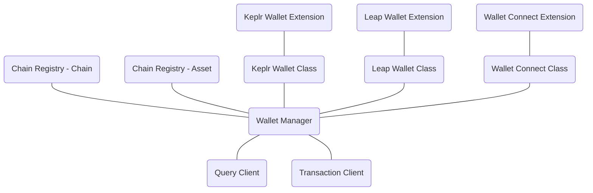
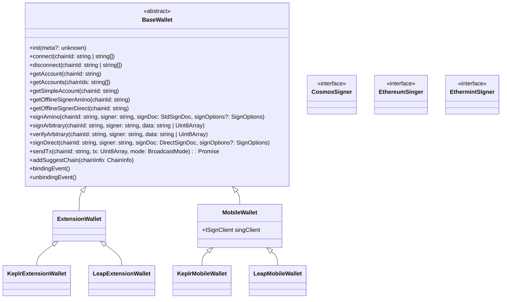

## core

<p align="center">
  <br />
    cosmos-kit wallet connector core package
</p>

## Install
Using npm:
```sh
npm install @interchain-kit/core
```

Using yarn;
```
yarn add @interchain-kit/core 
```
## Usage
### Query
```js
import { assetLists, chains } from '@chain-registry/v2';
import { keplrWallet } from '@interchain-kit/keplr-extension';
import { WalletManager } from '@interchain-kit/core';

const chainName = 'cosmoshub'
const walletName = 'keplr-extension'

const _chains = chains.filter(c => c.chainName === chainName)
const _assetLists = assetLists.filter(c => c.chainName === chainName)
const _wallets = [keplrWallet]

const wm = await WalletManager.create(_chains, _assetLists, _wallets)

const queryClient = await wm.getQueryClient(walletName, chainName)

const account = await wm.getAccount(walletName, chainName)

const { balance } = await queryClient.balance({ address: account.address, denom: 'uosmo' })

console.log(`i have ${balance?.amount}${balance?.denom} in ${chainName}`)

//i have 26589633uosmo in osmosis
```
### Signing
```js
import { assetLists, chains } from '@chain-registry/v2';
import { keplrWallet } from '@interchain-kit/keplr-extension';
import { WalletManager } from '@interchain-kit/core';

const chainName = 'osmosis'
const walletName = 'keplr-extension'

const _chains = chains.filter(c => c.chainName === chainName)
const _assetLists = assetLists.filter(c => c.chainName === chainName)
const _wallets = [keplrWallet]

const wm = await WalletManager.create(_chains, _assetLists, _wallets)

const cosmosSigningClient = await wm.getSigningCosmosClient(walletName, chainName)

const signerAccount = await wm.getAccount(walletName, chainName)

const receiveAddress = 'osmo1zx6zx6zx6zx6zx6zx6z6zx6xz6zx6zx6'

const fee = {
    amount: [
        {
            denom: 'uosmo',
            amount: '2500',
        },
    ],
    gas: '550000',
};

const token = {
    amount: '1000',
    denom: 'uosmo',
};

const message = { fromAddress: signerAccount.address, toAddress: receiveAddress, amount: [token] }

await cosmosSigningClient.helpers.send(signerAccount.address, message, fee, 'hello world')
```

## Developing

When first cloning the repo:

```
yarn
yarn build
```

## Related

Checkout these related projects:

* [@cosmology/telescope](https://github.com/cosmology-tech/telescope) Your Frontend Companion for Building with TypeScript with Cosmos SDK Modules.
* [@cosmwasm/ts-codegen](https://github.com/CosmWasm/ts-codegen) Convert your CosmWasm smart contracts into dev-friendly TypeScript classes.
* [chain-registry](https://github.com/cosmology-tech/chain-registry) Everything from token symbols, logos, and IBC denominations for all assets you want to support in your application.
* [cosmos-kit](https://github.com/cosmology-tech/cosmos-kit) Experience the convenience of connecting with a variety of web3 wallets through a single, streamlined interface.
* [create-cosmos-app](https://github.com/cosmology-tech/create-cosmos-app) Set up a modern Cosmos app by running one command.
* [interchain-ui](https://github.com/cosmology-tech/interchain-ui) The Interchain Design System, empowering developers with a flexible, easy-to-use UI kit.
* [starship](https://github.com/cosmology-tech/starship) Unified Testing and Development for the Interchain.

## Credits

🛠 Built by Cosmology — if you like our tools, please consider delegating to [our validator ⚛️](https://cosmology.zone/validator)


## Disclaimer

AS DESCRIBED IN THE LICENSES, THE SOFTWARE IS PROVIDED “AS IS”, AT YOUR OWN RISK, AND WITHOUT WARRANTIES OF ANY KIND.

No developer or entity involved in creating this software will be liable for any claims or damages whatsoever associated with your use, inability to use, or your interaction with other users of the code, including any direct, indirect, incidental, special, exemplary, punitive or consequential damages, or loss of profits, cryptocurrencies, tokens, or anything else of value.

## Overview




## UML
